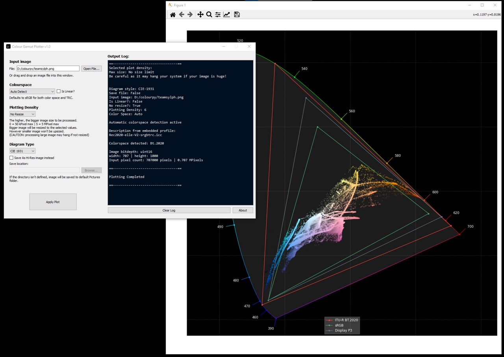

# Colour-Gamut-Plotter
A simple GUI for [Colour-Science](https://www.colour-science.org/) **plot_RGB_chromaticities_in_chromaticity_diagram** function

Written in **Python 3.9.13**

## Module Dependencies
- colour-science (primary, optional, graphviz, plotting, meshing, freeimage)
- matplotlib (for some reason in my case, it didn't installed from color-science optional)
- pyqt5
- opencv
- tifffile

## Features
- Image file opened with OpenCV instead, so image bit depth is preserved. As colour science read_image is using imageio and downsampled the image to 8 bit.
- Automatic colour profile detection parsed from embedded profile.
- Selectable plotting density. If image is bigger than the plotting density, image is resized with Nearest Neighbour so no interpolation is happening.
- Selectable diagram mode, between CIE 1930 or CIE 1976 UCS Chromaticity diagram.

## Limitation
- Only supports image with RGB model.
- When opening a multiple page TIFF, only the first page that will be plotted
